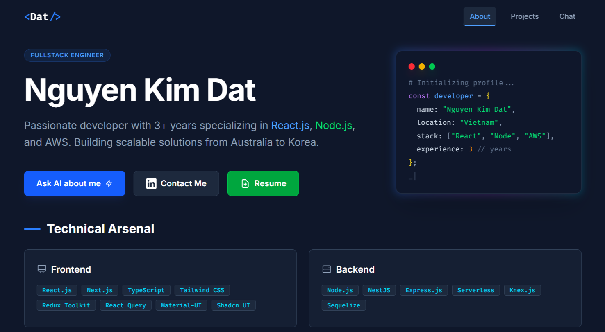

# Nguyen Kim Dat - Portfolio

🌐 **Live Demo:** [https://kimdat546.hypercoding.dev](https://kimdat546.hypercoding.dev)



A modern, interactive portfolio website built with React, TypeScript, and Tailwind CSS, featuring an AI-powered chat assistant powered by Google Gemini.

## ✨ Features

- **Interactive AI Chat** - Ask questions about my experience, powered by Gemini 2.5
- **Responsive Design** - Works seamlessly on desktop and mobile
- **Dark Theme** - Modern, eye-friendly dark UI with glowing accents
- **Terminal Animation** - Animated code snippet in hero section
- **Persistent Chat History** - Conversations saved to localStorage
- **SEO Optimized** - Meta tags and Open Graph support
- **Smooth Animations** - Page transitions and hover effects

## 🛠️ Tech Stack

- **Frontend:** React 18, TypeScript, Tailwind CSS v4
- **AI:** Google Gemini API (2.5 Flash & 2.5 Pro)
- **Build:** Vite
- **Fonts:** Inter, Fira Code

## 🚀 Getting Started

### Prerequisites

- Node.js 18+
- Yarn or npm

### Installation

```bash
# Clone the repository
git clone https://github.com/kimdat546/my-profile.git
cd my-profile

# Install dependencies
yarn install

# Create .env file with your Gemini API key
echo "VITE_API_KEY=your_gemini_api_key" > .env

# Start development server
yarn dev
```

### Build for Production

```bash
yarn build
```

## 📁 Project Structure

```
src/
├── components/
│   ├── ChatInterface.tsx    # AI chat component
│   ├── SkillBadge.tsx       # Skill tag component
│   ├── TerminalTyping.tsx   # Terminal animation
│   └── BackToTop.tsx        # Scroll to top button
├── services/
│   └── geminiService.ts     # Gemini API integration
├── App.tsx                  # Main app component
├── constants.ts             # Data & configuration
├── types.ts                 # TypeScript types
└── index.css                # Tailwind styles
```

## 📝 License

MIT License - feel free to use this as inspiration for your own portfolio!

## 👤 Author

**Nguyen Kim Dat**
- LinkedIn: [linkedin.com/in/kimdat546](https://linkedin.com/in/kimdat546)
- Email: kimdat546@gmail.com
